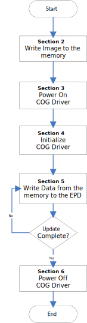
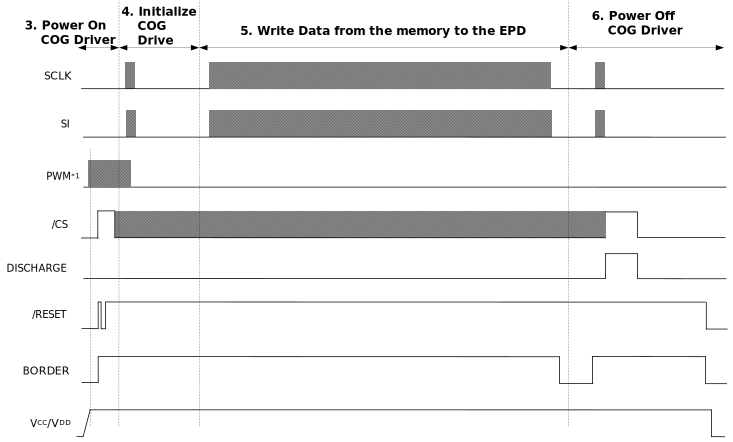
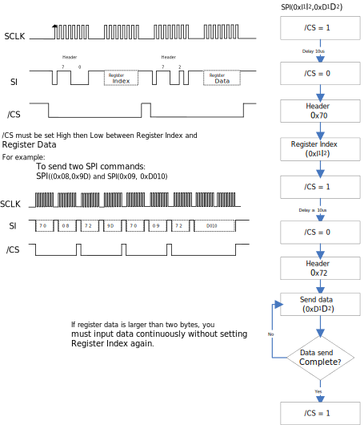
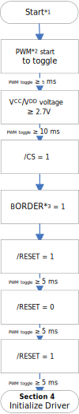
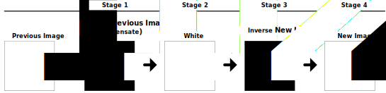
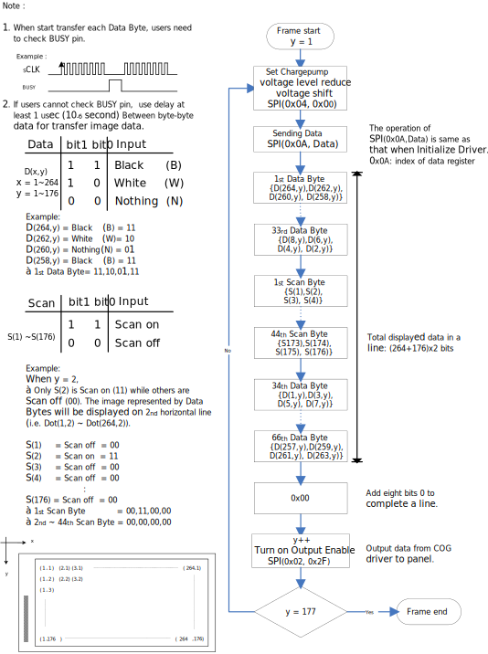
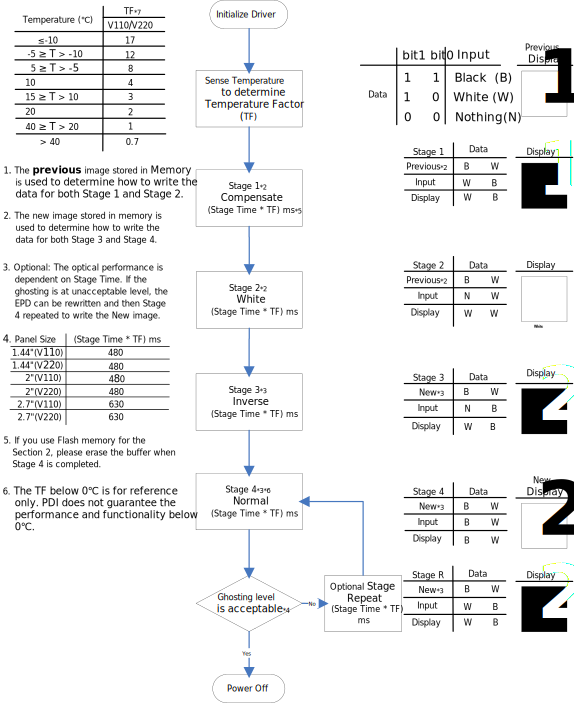
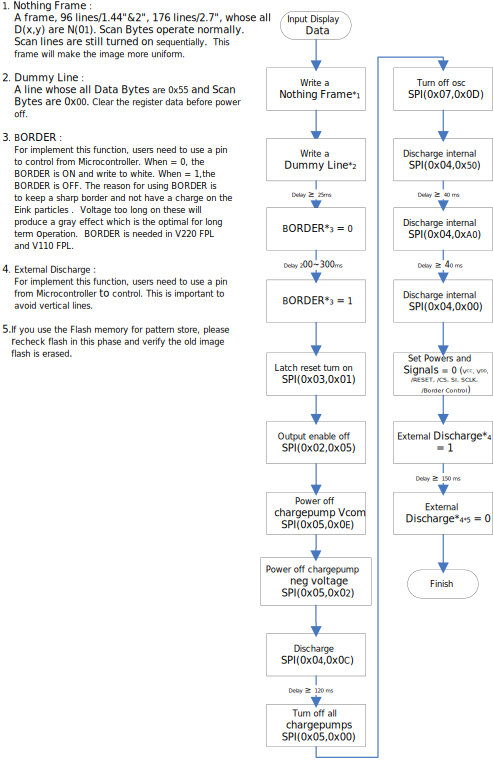

% ePaper Display COG Driver Interface Timing
% RePaper.org
% 2013

# ePaper Display COG Driver Interface Timing

--------------------  -------------------------
Description           Detailed information to design a timing controller for 1 44”, 2”, and 2.7” E-paper panels
Doc. No.              4P008-00
Revision              02
--------------------  -------------------------

# General Description

## Overview

This document explains the interface to the COG Driver to operate the
EPD for a MCU based solution using two pages of memory buffer. This
document applies to 1.44”, 2.0”, and 2.7” EPDs.

Both new and previous display images are stored in memory buffer, then
the COG Driver is powered on, initialized, panel updated in stages and
then the COG Driver is powered off. Refer to the EPD controller in
section 1.5 to see the complete update cycle from Power On, Initialize,
Update and Power off. To operate the EPDs for the best sharpness and
performance, each update of the panel is divided into a series of stages
before the display of the new image pattern is completed. During each
stage, frame updates with intermediate image patterns are repeated for a
specified period of time. The number of repeated frame updates during
each stage is dependent on the MCU speed. After the final stage, the new
pattern is displayed.

V110 and V220 are names for two types of Front Plane Laminate which is
the PET material that contains the microcapsules that is used to
manufacture EPDs. V110 is the current generation of material, and V220
is the next generation of material. The materials are similar but have a
few differences. V220 was designed to have a higher contrast ratio and
is excellent for e-readers which are frequently updated. For V110 and
V220, contrast ratio and white reflectance are compared in the charts
below for reference.

Around the active area of the EPD is a 0.5mm width blank area called the
border. It should be connected to V~DL~ (-15V) to keep the border white.
After approximately 10,000 updates with the constant voltage, the border
color may degrade to a gray level that is not as white as the active
area. To prevent this phenomenon, PDI recommends connecting BORDER as
described in our documentation so that it can receive a control signal
to turn on and off to avoid the degradation.

Section 1 is an overview and contains supporting information such as the
overall theory for updating an EPD, SPI timing for PDI’s EPDs, as well
as current profiles.

Section 2 describes a method to write to memory buffer. Previously
updated and new patterns are stored in the memory buffer to compare the
old and new image patterns during the update.

Section 3 describes how to power on the COG Driver which consists of
applying a voltage and generating the required signals for /CS and
/RESET.

Section 4 describes the steps to initialize the COG Driver.

Section 5 describes the details on how to update the EPD from the memory
buffer, create a line of data, update in stages, and also power down
housekeeping steps.

## Input Terminal Pin Assignment

-------------------------------------------------------------------------------
No  Signal            I/O  Connected to          Function
--  -------------  -  ---  --------------------  ------------------------------
1   /CS               I    MCU                   Chip Select. Low enable

2   BUSY              O    MCU                   When BUSY = HIGH, EPD stays in
                                                 busy state that EPD ignores
                                                 any input data from SPI.

3   ID                I    Ground                Set SPI interface

4   SCLK              I    MCU                   Clock for SPI

5   SI                I    MCU                   Serial input from host MCU to
                                                 EPD

6   SO                O    MCU                   Serial output from EPD to host
                                                 MCU

7   /RESET            I    MCU                   Reset signal. Low enable

8   ADC_IN            -    -                     Not connected

9   V~CL~             C    Capacitor             -

10  C42P              C    Charge-Pump           -
                           Capacitor

11  C42M              C                          -

12  C41P              C    Charge-Pump           -
                           Capacitor

13  C41M              C                          -

14  C31M              C    Charge-Pump           -
                           Capacitor

15  C31P              C                          -

16  C21M              C    Charge-Pump           -
                           Capacitor

17  C21P              C                          -

18  C16M              C    Charge-Pump           -
                           Capacitor

19  C16P              C                          -

20  C15M              C    Charge-Pump           -
                           Capacitor

21  C15P              C                          -

22  C14M              C    Charge-Pump           -
                           Capacitor

23  C14P              C                          -

No  Signal            I/O  Connected to          Function

24  C13M              C    Charge-Pump           -
                           Capacitor

25  C13P              C                          -

26  C12M              C    Charge-Pump           -
                           Capacitor

27  C12P              C                          -

28  C11M              C    Charge-Pump           -
                           Capacitor

29  C11P              C                          -

30  V~COM_DRIVER~     RC   Resistor & Capacitor  The signal duty cycle can
                                                 drive V~COM~ voltage from
                                                 source driver IC

31  V~CC~             P    V~CC~                 Power supply for analog
                                                 part of source driver

32  V~DD~             P    V~DD~                 Power supply for digital part
                                                 of source driver

33  V~SS~             P    Ground                -

34  V~GH~             C    Capacitor             -

35  V~GL~             C    Capacitor             -

36  V~DH~             C    Capacitor             -

37  V~DL~             C    Capacitor             -

38  BORDER            I    -                     Connect to V~DL~ via control
                                                 circuit for white frame border

39  V~ST~             P    V~COM_PANEL~          -

40  V~COM_PANEL~      C    Capacitor             V~COM~ to panel

-------------------------------------------------------------------------------

    Note:
    I: Input
    O: Output
    C: Capacitor
    RC: Resistor and Capacitor
    P: Power

## Reference Circuit

Note:

​1. V~DD~ and V~CC~ must be discharged promptly after power off.
​1. Pin.1 location

## EPD Driving Flow Chart

The flowchart below provides an overview of the actions necessary to
update the EPD. The steps below refer to the detailed descriptions in
the respective sections.

## Controller

The diagram below provides a signal control overview during an EPD
update cycle. The diagram is segmented into “3. Power On COG Driver”,
“4. Initialize COG Driver”, “5. Write data from the memory to the EPD”,
and “6. Power Off COG Driver”. The segment number and title matches a
section title in this document which contain the details for each
segment.

Note:

​1. PWM: 100\~300 KHz Duty= 50% Square wave.

The PWM signal starts before V~CC~/V~DD~ input and stops during the
initialization of the COG Driver to ensure there is a negative VGL on
the COG Driver. Our reliability testing shows that with low temperature
that the COG Driver has the possibility of V~CC~ generating a slightly
positive voltage, and the PWM is an effective solution for this
condition. Refer to the section 4 of this spec.

## SPI Timing Format

SPI commands are used to communicate between the MCU and the COG Driver.
The SPI format used differs from the standard in that two way
communications are not used, and CS is pulled high then low between
clocks. When setting up the SPI timing, PDI recommends verifying the
control signals for the overall waveform in Section 1.5, next verify the
SPI command format and SPI command timing both in this section.

The maximum clock speed that the display can accept is 12MHz. The
minimum is 4MHz. The SPI mode is 0.

* Below is a description of the SPI Format:

SPI(0xI~1~I~2~, 0xD~1~D~2~D~3~D~4,~D~5~D~6~D~7~D~8~…)

Where:

I~m~I~n~ is the Register Index and the length is 1 byte D~m\~n~ is the
Register Data. The Register Data length varies from 1, 2, to 8 bytes
depending on which Register Index is selected.

-------------------------------------------------
Register Index  Number Bytes of Register Data
--------------  ---------------------------------
0x01            8

0x02            1

0x03            1

0x04            1

0x05            1

0x06            1

0x07            1

0x08            1

0x09            2

-------------------------------------------------

* Before sending the Register Index, the SPI (SI) must send a 0x**70**
header command.

* Likewise, the SPI (SI) must send a 0x**72** is the header command
prior to the Register Data. The flow chart and detailed description can
be found on the next page.

* SPI command signals and flowchart:

* SPI command timing

# Write to the Memory

Before powering on COG Driver, the developer should write the new
pattern to image buffer, either SRAM or flash memory. The image pattern
must be converted to a 1 bit bitmap format (Black/White) in prior to
writing.

Two buffer spaces should be allocated to store both previous and new
patterns. The previous pattern is the currently displayed pattern. The
new pattern will be written to the EPD. The COG Driver will compare both
patterns before updating the EPD. The table below lists the buffer space
size required for each EPD size.

-----------------------------------------------------------------------
EPD size  Image resolution(pixels)  Previous + new image Buffer (bytes)
--------  ------------------------  -----------------------------------
1.44"     128 x 96                  3,072

2"        200 x 96                  4,800

2.7"      264 x 176                 11,616

-----------------------------------------------------------------------

# Power On COG Driver

This flowchart describes power sequence for the COG Driver.

​1. Start :

Initial State:

V~CC~/V~DD~, /RESET, /CS, BORDER, SI, SCLK = 0

​2. PWM:

100\~300KHz, 50% duty cycle, square wave to eliminate the potential
negative voltages that could occur at low temperature. Keeping PWM
toggling until VGL & VDL is on (SPI(0x05,0x03)).

​3. BORDER:

For implement this function, Developer needs to use a pin from
Microcontroller to control. BORDER is used to keep a sharp border while
taking care of the electronic ink particles.

# Initialize COG Driver

Note:

​1. SPI(0x01, Data):

  * Different by each size

    * 1.44”: SPI(0x01, (0x0000,0000,000F,FF00))

    * 2”: SPI(0x01, (0x0000,0000,01FF,E000))

    * 2.7”: SPI(0x01, (0x0000,007F,FFFE,0000))

  * To send first byte protocol (0x70) before Register Index (0x01), and then send second byte protocol (0x72) before Register Data (0x0000,0000,01FF,E000).

​1. If register data is larger than two bytes, the developer must finish
sending the data prior to sending another Register Index command.

​1. PWM: 100\~300KHz, 50% duty cycle, square wave to eliminate the
potential negative voltages that could occur at low temperature.

​1. Should measure VGH \>12V and VDH \>8V

​1. Should measure VGL \<-12V and VDL \<-8V

​1. Gate and Source Voltage Level is different by each size:

  * Different by each size

    * 1.44”: SPI(0x04,0x03)

    * 2”: SPI(0x04,0x03)

    * 2.7”: SPI(0x04,0x00)

# Write data from the memory to the EPD

This section describes how data should be sent to the COG Driver which
will update the display. The COG Driver uses a buffer to store a line of
data and then writes to the display.

## Data Structure

* EPD Resolutions

--------------------------------------------
EPD size  Image resolution(pixels)  X    Y
--------  ------------------------  ---  ---
1.44"     128 x 96                  128  96

2"        200 x 96                  200  96

2.7"      264 x 176                 264  176

--------------------------------------------

* Data components

  * One Bit – A bit can be W (White), B (Black) or N (Nothing) bits. Using
  the N bit mitigates ghosting.

  * One Dot/pixel is comprised of 2 bits.

  * One line is the number of dots in a line. For example:

    * The 1.44” uses 128 Dots to represent 1 Line.

    * The 2” uses 200 Dots to represent 1 Line.

    * The 2.7” uses 264 Dots to represent 1 Line.

    * The COG Driver uses a buffer to write one line of data (FIFO) -
    interlaced

-------------------------------------------------------------------------------
Data Bytes                 Scan bytes              Data Bytes
-------------------------  ----------------------  ----------------------------
1^st^ - 25^th^ (Even)      1^st^ - 24^th^          26^th^ - 50^th^ (Odd)

2" Example: Because        2" Example: Write       2" Example: Write the odd
method to write is         bytes for every scan    data bytes for a line
interlaced, write the      line {S(1),S(2),            {D(1,y),D(3,y), D(5,y),
even data bytes for a          S(3), S(4)}....     D(7,y)}.........
line {D(200,y),D(198,y),   {S(93),S(94),           {D(193,y),D(195,y),D(197,y),
D(196,y), D(194,y)} ....       S(95), S(96)}       D(199,y)}
{D(8,y),D(6,y),D(4,y),
D(2,y)}

-------------------------------------------------------------------------------

* One frame of data is the number of lines \* rows. For example:

  * The 1.44” frame of data is 96 lines \* 128 dots.

  * The 2” frame of data is 96 lines \* 200 dots.

  * The 2.7” frame of data is 176 lines \* 264 dots.

* One stage is the number of frames used to write an intermediate
pattern. This can vary based on the MCU choice. PDI’s design writes 16
frames of data per stage, and then 4 stages for 2” and 1.44” to update
the display from the previous to the new pattern. 2.7” need 21 frames of
data per stage.

-----------------------------------------------------------------
Panel Size  FPL   Stage Time (ms)  MCU Frame Time (ms)(Recommend)
----------  ----  ---------------  ------------------------------
1.44"       V110  480              > 50ms

1.44"       V220  480

2"          V110  480

2"          V220  480

2.7"        V110  630              > 70ms

2.7"        V220  630

-----------------------------------------------------------------

## Store a line of data in the buffer

This section describes the details of how to send data to the COG
Driver. The COG Driver uses a buffer to update the display line by line.

* 1.44” Input Data Order

* 2” Input Data Order

* 2.7” Input Data Order

## Writing to the display in stages

This section contains the method to write to the display in stages. Each
of the 4 stages should be the same use the same number of frames.
Rewrite the frame during each stage.

The flow chart that follows describes how to update an image from a
previous displayed image stored in memory buffer to a new image also
stored in memory buffer. See the sample previous and new images below.

# Power off COG Driver

-----

# include glossary

-----

# include copyright

