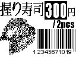
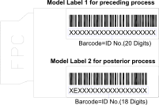
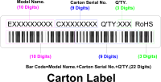
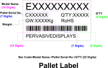

% 1.44” TFT EPD Panel
% RePaper.org
% 2013

# 1.44” TFT EPD Panel Product Specifications

--------------------  -------------------------
Description           1.44” TFT EPD Panel
Model Name            EK014AS014
Doc. No.              1P036-00
Revision              01
--------------------  -------------------------

# General Description

## Overview

This is a 1.44” a-Si, active matrix TFT, Electronic Paper Display (EPD)
panel. The panel has such high resolution (111 dpi) that it is able to
easily display fine patterns. Due to its bi-stable nature, the EPD panel
requires very little power to update and needs no power to maintain an
image.

## Features

* a-Si TFT active matrix Electronic Paper Display(EPD)
* Resolution: 128 x 96
* Ultra low power consumption
* Super Wide Viewing Angle - near 180°
* Extra thin & light
* SPI interface
* RoHS compliant

## Applications

* Electronic shelf label (ESL)
* Reusable container
* Badge

## General Specifications

----------------------------------------------------------------
Item               Specification                     Unit   Note
-----------------  --------------------------------  -----  ----
Outline Dimension  40.512(H) x 28.800(V) x 1.200(T)  mm     (1)

Active Area        29.312(H) x 21.984(V)             mm

Driver Element     a-Si TFT active matrix            -

FPL                V110                              -

Pixel Number       128 x 96                          pixel

Pixel Pitch        0.229 x 0.229 (111dpi)            mm

Pixel Arrangement  Vertical stripe                   -

Display Colors     Black/White                       -

Surface Treatment  Anti-Glare                        -

----------------------------------------------------------------

Note (1): Not including the FPC.

## Mechanical Specifications

----------------------------------------------------------
Item                       Min.   Typ.   Max.   Unit  Note
----------  -------------  -----  -----  -----  ----  ----
Glass Size  Horizontal(H)  40.21  40.51  40.81  mm

            Vertical(V)    28.50  28.80  31.10  mm

            Thickness(T)   1.1    1.2    1.3    mm    (1)

Weight                     -      2.9    3.5    g

----------------------------------------------------------

Note (1): Not including the Masking Film.

## FPC Specification

-----------------------------------------------------------------------------
Item           Pin numbers  Pitch (mm)  Connector                        Note
-------------  -----------  ----------  -------------------------------  ----
Golden Finger  40           0.5         STARCONN 089H40 or Compatible

-----------------------------------------------------------------------------

# Absolute Maximum Ratings

## Absolute Ratings of Environment

------------------------------------------------------------------
Item                           Symbol  Value        Unit  Note
-----------------------------  ------  -----  ----  ----  --------
                                       Min.   Max.

Storage Temperature            T~ST~   -20    +60   ºC    (1)

Operating Ambient Temperature  T~OP~   0      +50   ºC    (1), (2)

------------------------------------------------------------------

Note (1):

​* 90 %RH Max. (Ta ≦ 40 ºC), where Ta is ambient temperature.

* Wet-bulb temperature should be 39 ºC Max. (Ta > 40 ºC).
* No condensation.

Note (2): The temperature of panel display surface area should be 0 ºC
Min. and 50 ºC Max. Refresh time depends on operation temperature.

## Reliability Test Item

-------------------------------------------------------------------------------
Item                            Test Condition                         Remark
------------------------------  -------------------------------------  --------
High Temperature Operation      50 ℃ for 240h                          ​(1) (2)

High Temperature Storage        60 ℃ for 240h                          ​(1) (2)

Low Temperature Operation       0 ℃ for 240h                           ​(1) (2)

Low Temperature Storage         -20 ℃ for 240h                         ​(1) (2)

High Temperature/Humidity       40 ℃ / 90 %RH for 168h                 ​(1) (2)
Operation

High Temperature/Humidity       50 ℃ / 80 %RH for 168h                 ​(1) (2)
Storage

Thermal Cycles (Non-operation)  1 Cycle:-20℃/30min → 60℃/30min, for    ​(1) (2)
                                100 Cycles

Package Drop Test               Drop from 97cm. (ISTA)               ​  (1) (2)
                                1 corner, 3 edges, 6 sides. One drop
                                for each.

Package Random Vibration Test   1.15Grms, 1Hz \~ 200Hz. (ISTA)       ​  (1) (2)

-------------------------------------------------------------------------------

Note (1): End of test, function, mechanical, and optical shall be
satisfied.

Note (2): The test result and judgment are based on PDI’s 1bit driving
waveform, driving fixture and driving system.

# Electrical Characteristics

## Absolute Maximum Ratings of Panel

----------------------------------------------------------------
Parameter      Symbol  Value       Unit  Note
-------------  ------  -----  ---  ----  -----------------------
                       Min    Max

Digital Power  V~DD~   -0.3   5.0  V

Analog Power   V~CC~   -0.3   5.0  V

Ground         V~SS~   -           -     Connect V~SS~ to Ground

----------------------------------------------------------------

Ta = 25 ± 2 ºC

## Recommended Operation Conditions of Panel

-------------------------------------------------------------------------------
Parameter            Symbol      Value                    Unit  Note
-------------  ----  ----------  --------  ---  --------  ----  ---------------
                                 Min       Typ  Max

Digital Power        V~DD~       2.7       3.0  3.3       V

Analog Power         V~CC~       2.7       3.0  3.3       V

Input Voltage  High  V~IH~       0.8V~DD~  -    V~DD~     V     /CS, ID, SCLK,
                                                                SI, /RESET

               Low   V~IL~       V~SS~     -    0.2V~DD~  V

Output         High  V~OH~       0.8V~DD~  -    V~DD~     V     I~OH~=0.5mA,
Voltage                                                         SO, BUSY

               Low   V~OL~       V~SS~     -    0.2V~DD~  V     I~OL~=-0.5mA,
                                                                SO, BUSY

Input Leakage  High  I~IH~       -         -    1.0       uA
Current

               Low   I~IL~       -         -    -1.0      uA

Input Current        I~DD~       -         6    -         mA    (1),(2)
                     +I~CC~                                     not include
                                                                inrush current

DC/DC Inrush         I~PEAK~     -         40   -         mA    (1),(2)
Current

-------------------------------------------------------------------------------

Ta = 25 ± 2 ºC

Note (1):

These currents are tested with PDI test jig.

Note (2):

V~DD~=V~CC~=3.0V

The “Time of DC/DC ON” which contains the some current peak of
V~GH~/V~DH~/V~GL~/V~DL~/V~COM~.

# Application Circuit Block Diagram

# Terminal Pin Assignment & Reference Circuit

## Terminal Pin Assignment

-------------------------------------------------------------------------------
No.  Signal          Type  Connected to          Function
---  --------------  ----  --------------------  ------------------------------
1    /CS             I     MCU                   Chip Select. Low enable

2    BUSY            O     MCU                   When BUSY = High, EPD stays in
                                                 busy state that EPD ignores
                                                 any input
                                                 data from SPI.

3    ID              I     Ground                Set SPI interface.

4    SCLK            I     MCU                   Clock for SPI

5    SI              I     MCU                   Serial input from host MCU to
                                                 EPD

6    SO              O     MCU                   Serial output from EPD to host
                                                 MCU

7    /RESET          I     MCU                   Reset signal. Low enable

8    ADC_IN          -     -                     Not connected

9    V~CL~           C     Capacitor

10   C42P            C     Charge-Pump
                           Capacitor

11   C42M            C

12   C41P            C     Charge-Pump
                           Capacitor

13   C41M            C

14   C31M            C     Charge-Pump
                           Capacitor

15   C31P            C

16   C21M            C     Charge-Pump
                           Capacitor

17   C21P            C

18   C16M            C     Charge-Pump
                           Capacitor

19   C16P            C

20   C15M            C     Charge-Pump
                           Capacitor

21   C15P            C

22   C14M            C     Charge-Pump
                           Capacitor

23   C14P            C

24   C13M            C     Charge-Pump
                           Capacitor

25   C13P            C

26   C12M            C     Charge-Pump
                           Capacitor

27   C12P            C

28   C11M            C     Charge-Pump
                           Capacitor

29   C11P            C

30   V~COM_DRIVER~   RC    Resistor & Capacitor  The signal duty cycle can
                                                 drive V~COM~ voltage from
                                                 source driver IC.

31   V~CC~           P     V~CC~                 Power supply for analog part
                                                 of source driver.

32   V~DD~           P     V~DD~                 Power supply for digital part
                                                 of source driver.

33   V~SS~           P     Ground

34   V~GH~           C     Capacitor

35   V~GL~           C     Capacitor

36   V~DH~           C     Capacitor

37   V~DL~           C     Capacitor

38   BORDER          I     -                     Connect to V~DL~ via control
                                                 circuit for white frame border

39   V~ST~           P     V~COM_PANEL~

40   V~COM_PANEL~    C     Capacitor             V~COM~ to panel

-------------------------------------------------------------------------------

Note:

Type: I: Input

O: Output
C: Capacitor
RC: Resistor and Capacitor
P: Power

## Reference Circuit

Note: (1) V~DD~ and V~CC~ must be discharged promptly after power off.

# Optical Characteristics

## Test Conditions

----------------------------------------------
Item                 Symbol        Value  Unit
-------------------  ------------  -----  ----
Ambient Temperature  Ta            25±2   ºC

Ambient Humidity     Ha            50±10  %RH

Supply Voltage       V~CC~& V~DD~  3.0    V

----------------------------------------------

## Optical Specifications

## Optical Measurement with D65 light source

--------------------------------------------------------------------------------
Item                Symbol  Rating               Unit  Note
------------------  ------  ------  -----  ----  ----  -------------------------
                            Min.    Typ.   Max.

Contrast ratio      CR      5:1     7:1    -     -     θx=θy=0
                                                       (1),(2),(3),(4)

Refresh time        Tr      -       2.2    -     sec   (3)

White Chromaticity  Wx      -       0.313  -     -     θx=θy=0
                                                       (1),(4)

                    Wy      -       0.338  -

Reflectance         R%      25      32     -     %     (1),(4)

--------------------------------------------------------------------------------

Note (1): Panel is driven by PDI waveform without masking film and
optical measurement by CM-700D with D65 light source and SCE mode.

Note (2): Definition of Viewing Angle (qx, qy):

Note (3): Refresh time is the time that e-paper particles move not
including the power on and off time. The refresh time is measured at
25ºC.The refresh time and contrast ratio varies due to different films,
display performance requirements, and ambient temperatures.

Note (4): Contrast ratio (C.R.): The Contrast ratio is calculated by the
following expression. C.R. =(R% White) / (R% Black). Reflectance is
measured at 120 seconds after refresh.

# include ghosting

# include precautions

# Definition of Labels

-----

# include glossary

-----

# include copyright

