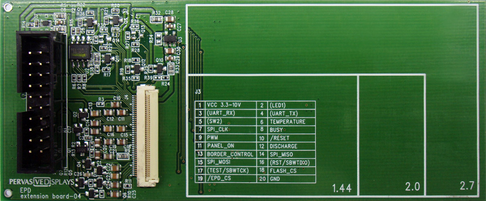
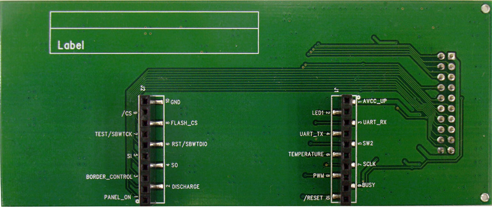
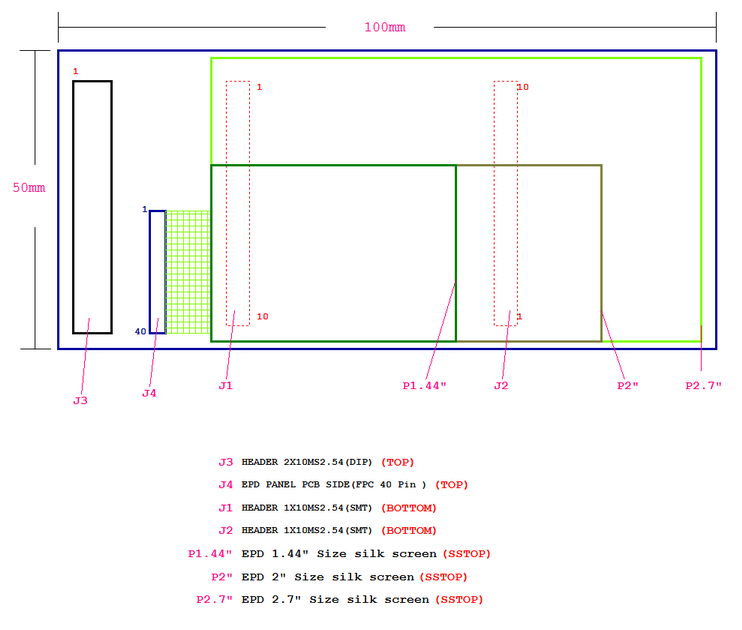
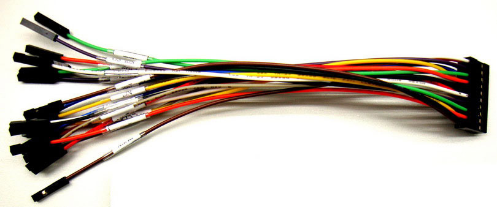

% EPD Extension Board
% RePaper.org
% 2013

# EPD Extension Board

## Introduction

The EPD extension board supports driving 1.44, 2.0, and 2.7 inch ePaper display (EPD)
modules with your development projects. This expansion board provides a 20 control pins
connection with your product or development kit to drive EPD via SPI
interface.

<a href="http://www.adafruit.com/products/1316" target="_blank" class="btn buy">Buy Now</a>

**<a href="http://www.adafruit.com/products/1316">The EPD Extension board is available for international shipment from our friends at Adafruit Industries.</a>**

## Features

* Starter board to work with EPD
* Supports driving 1.44", 2.0" or 2.7" EPD Panels
* On board 8M bits serial flash memory and temperature sensor
* VCC input voltage is available from 10V to 3V
* 20 input/output pins bridge to any development/evaluation kit or product
* Drect connect socket for Texas Instruments LaunchPad
* Documentation for Panels and driving waveform
* Source code for simple demonstration programs

## Board Picture

* Front View 
* Rear view  
* Board placement 
* 20 pin cable (for Arduino or bridging to other kit) 

## Pin Assignment

The table below give the pin connections of the 20-pin male ribbon
connector.  Looking a the board oriented display side up (as front
view above) and connector on the left.  Pin 1 is the top left pin (the
left column are all odd numbered pins) and pin 2 is immediately to its
right (right hand column is all the even pins).  There is also small 1
and 2 on the PCB silk screen above the socket and a 19 and 20 below
the socket.

Pin Number   Description       Colour   Leonardo    Uno          Mega
----------   ---------------   ------   ---------   ----------   ---------
1.           Vcc 3V            Red      3.3V        3.3V         3.3V
2.           *(LED1)*          White    -           -            -
3.           *(UART_RX)*       Grey     -           -            -
4.           *(UART_TX)*       Purple   -           -            -
5.           *(SW2)*           Blue     -           -            -
6.           Temperature       Green    Analog-A0   Analog-A0    Analog-A0
7.           SPI\_CLK          Yellow   ICSP-3      Digital-13   Digital-52
8.           BUSY              Orange   Digital-7   Digital-7    Digital-7
9.           PWM               Brown    Digital-5   Digital-5    Digital-5
10.          /RESET            Black    Digital-6   Digital-6    Digital-6
11.          PANEL\_ON         Red      Digital-2   Digital-2    Digital-2
12.          DISCHARGE         White    Digital-4   Digital-4    Digital-4
13.          BORDER_CONTROL    Grey     Digital-3   Digital-3    Digital-3
14.          SPI_MISO          Purple   ICSP-1      Digital-12   Digital-50
15.          SPI_MOSI          Blue     ICSP-4      Digital-11   Digital-51
16.          *(RST/SBWTDIO)*   Green    -           -            -
17.          *(TEST/SBWTCK)*   Yellow   -           -            -
18.          FLASH\_CS         Orange   Digital-9   Digital-9    Digital-9
19.          /EPD\_CS          Brown    Digital-8   Digital-8    Digital-8
20.          GND               Black    GND         GND          GND

### Notes

* The above values in parentheses like *(SW2)*, are not connected
  to the driver circuit and can be left open on non-LaunchPad
  projects.  These are only provided so that all the LaunchPad pins
  are brought through to the 20 pin connector.
* Active low signals are indicated with a leading solidus (slash) e.g. /RESET
* The ICSP pins on a Leonardo have a small dot to mark pin 1 and the letters ICSP
  above it; pin 2 is to the right of pin 1, same as the normal IDC ribbon cable order
  i.e. left colum 1,3,5 and right column 2,4,6.  More details on the
  [Arduino Leonardo page](http://arduino.cc/en/Main/arduinoBoardLeonardo)

